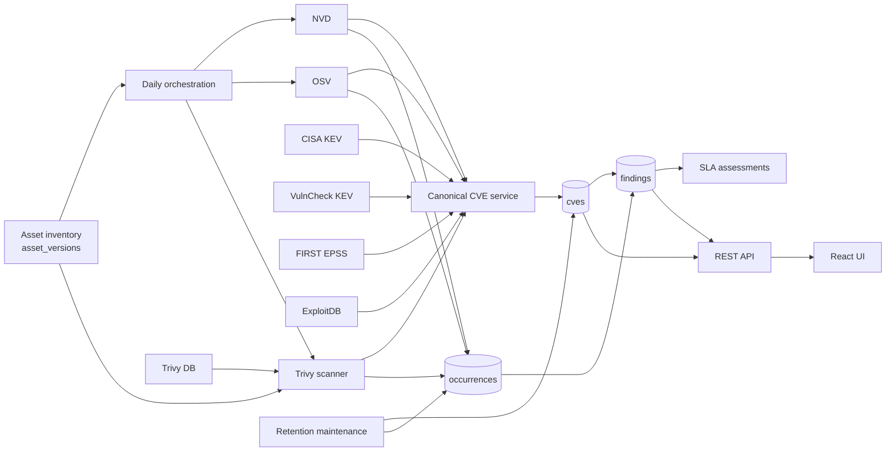
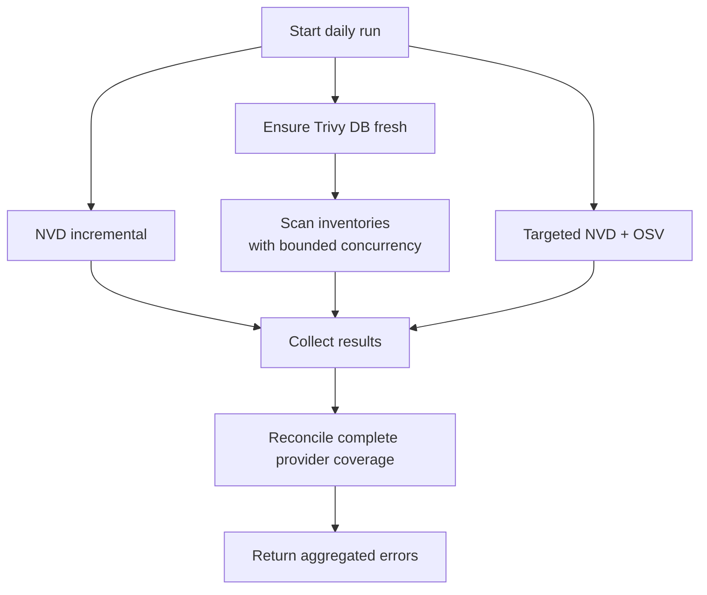

# Vulnerability Intelligence Module

> Synapse adaptation, September 11, 2026: the source-system specification below is
> retained for traceability. For this repository, the product contract in
> [the implementation plan](docs/guide/vulnerability-intelligence-implementation-plan.md)
> takes precedence. Synapse alone scans assets and persists inventory. Vulnerability
> Intelligence synchronizes the existing advisory database and correlates changes
> against that inventory without rescanning. Do not implement Trivy, another scanner,
> or another vulnerability database. Source-system verification below is not Synapse
> verification evidence.

> Current implementation snapshot: 2026-09-10  
> Source system: `vuln-assets-management`  
> Intended consumer: an AI implementing this module in another codebase with a similar architecture

## 1. How to use this document

This is a self-contained implementation package for the current **Vulnerability Intelligence** module. It describes the architecture, data contracts, provider behavior, persistence rules, API/UI surface, configuration, failure semantics, security requirements, known defects, and a recommended porting sequence.

Normative labels:

- **AS-IS**: behavior implemented in the current repository.
- **PORTING REQUIREMENT**: behavior that should be preserved.
- **KNOWN GAP**: current behavior that should not be copied blindly.
- **RECOMMENDED FIX**: intended improvement for a new implementation.

Relative source paths are included only for traceability. The target codebase does not need the same directory layout or language.

## 2. Objective and boundaries

The module turns external vulnerability intelligence and local software inventory into actionable asset findings. It owns:

1. Ingestion and normalization from NVD, OSV, CISA KEV, VulnCheck KEV, FIRST EPSS, ExploitDB, and Trivy.
2. Matching vulnerabilities to asset components using CPE and ecosystem-aware version ranges.
3. Component-level evidence with active, resolved, and reopened lifecycle states.
4. One remediation workflow finding per `(asset, CVE)`.
5. CVE browsing, finding impact, ingest health, manual execution, and administration through API and UI.

### 2.1 Keep these domains separate

| Domain | Primary storage | Purpose |
|---|---|---|
| Canonical CVE intelligence | `cves` | Normalized advisory records for browsing and matching |
| Asset remediation workflow | `findings`, `asset_vulnerability_occurrences` | Evidence and workflow state for asset vulnerabilities |
| Scanner database catalogue | `vulnerability_database_entries` | Separate “Vulnerability Database” snapshot/search feature |

This document covers the first two domains and their Trivy integration. Do not conflate the scanner catalogue with the canonical CVE store.

## 3. Architecture



Two matching paths coexist:

- **Occurrence-based:** daily Trivy and targeted NVD/OSV write source-scoped evidence, then reconcile findings.
- **Legacy correlation:** scans candidate CVEs against asset versions and directly upserts findings. It remains in import and manual-correlation flows.

## 4. Runtime stack and external services

- Go services/repositories.
- PostgreSQL using JSONB, expression indexes, transactions, and `FOR UPDATE SKIP LOCKED`.
- Trivy CLI with a shared on-disk database cache.
- React, TypeScript, React Router, React Query, and Vite.
- Cookie JWT authentication supplied by the wider application.

| Provider | Endpoint | Authentication |
|---|---|---|
| NVD CVE API 2.0 | `https://services.nvd.nist.gov/rest/json/cves/2.0` | Optional `apiKey` header |
| OSV | `https://api.osv.dev/v1` | None |
| CISA KEV | CISA JSON, GitHub mirror fallback | None |
| VulnCheck KEV | `https://api.vulncheck.com/v3/backup/vulncheck-kev` | Bearer token |
| FIRST EPSS | `https://api.first.org/data/v1/epss` | None |
| ExploitDB | GitLab raw `files_exploits.csv` | None |

## 5. Current source map

| Area | Current paths |
|---|---|
| Canonical model/service/repository | `internal/intel/cve.go`, `service.go`, `postgres.go` |
| Providers | `internal/intel/nvd.go`, `osv.go`, `kev.go`, `vulncheck_kev.go`, `epss.go`, `exploitdb.go` |
| Targeted refresh/scheduling/retention | `internal/intel/targeted.go`, `schedule.go`, `maintenance.go` |
| Trivy | `internal/trivy/cli.go`, `database.go`, `trivy.go`, `postgres.go` |
| Matching/version semantics | `internal/correlation/service.go`, `matcher.go`, `cpe.go`, `postgres.go`, `version/*` |
| Daily orchestration and wiring | `internal/cli/vulnerability_daily.go`, `serve.go`, `helpers.go`, `ingest.go` |
| HTTP | `internal/api/handlers_cves.go`, `handlers_ingest.go`, `handlers_assets.go`, `handlers_findings.go`, `server.go` |
| Frontend | `frontend/src/api/{cves,ingest,findings}.ts`, `pages/Vulnerabilities.tsx`, `VulnerabilityDetail.tsx`, `AdminIngest.tsx` |
| Migrations | `0001`, `0002`, `0004`, `0005`, `0007`, `0086`, `0087` under `internal/db/migrations/` |

## 6. Domain model

### 6.1 Canonical CVE

```text
CVE
  id: string
  cvss_v3_score: decimal?
  cvss_v3_vector: string?
  severity: Critical | High | Medium | Low | Unknown
  published_at: timestamp?
  modified_at: timestamp?
  summary: string?
  source: string?
  exploitability:
    in_kev: boolean?
    epss_score: decimal?
    epss_percentile: decimal?
    public_poc: boolean?
    active_exploitation: boolean?
  affected[]:
    cpe: string?
    package_name: string?
    ecosystem: string?
    ranges[]: { introduced: string?, fixed: string? }
  raw_payload: JSON?
  ingested_at: timestamp
```

### 6.2 Asset component

```text
AssetVersion
  id, asset_id
  component_type: os | runtime | lib | app | appliance | container
  component_name, version
  ecosystem: deb | rpm | npm | pypi | jar | maven | go | appliance | container
  cpe?, package_url?, supplier?, sbom_source?
  is_direct_dependency: boolean
  dependency_path?
```

### 6.3 Occurrence versus finding

An occurrence is evidence for one vulnerability on one component. A finding is the workflow record aggregated at asset+CVE level.

```text
Asset A
  Component X -- CVE-1 from Trivy --┐
  Component Y -- CVE-1 from OSV ----┼--> one finding (Asset A, CVE-1)
  Component Z -- CVE-1 from NVD ----┘
```

Do not store all component/source evidence only in the finding row.

## 7. Persistence contract

### 7.1 `cves`

Required fields: `id` text primary key; CVSS score/vector; constrained severity; publication/modification dates; summary; source; `exploitability` JSONB default `{}`; `affected` JSONB default `[]`; optional raw payload; ingestion timestamp.

### 7.2 `scan_runs`

```text
id, asset_id, scanner, target_type, target_ref,
commit_sha, image_digest, status: succeeded | failed,
component_count, vulnerability_count, license_count,
started_at, finished_at, raw_payload,
coverage_key, authoritative, database_updated_at
```

### 7.3 `asset_vulnerability_occurrences`

```text
id, asset_id, scan_run_id, last_seen_run_id,
vulnerability_id, canonical_cve_id, component_id,
package_name, package_url, installed_version, fixed_version,
module_name, module_path, scanner, coverage_key,
severity, title, description, reference_urls[],
presence_status: active | resolved | reopened,
first_seen_at, last_seen_at, resolved_at, reopened_count,
created_at, updated_at
```

The unique normalized identity is:

```text
asset_id
+ lower(trim(vulnerability_id))
+ lower(trim(package_name))
+ lower(trim(installed_version or ''))
+ lower(trim(module_path or ''))
+ lower(trim(scanner))
+ lower(trim(coverage_key))
```

Enforce this with a database unique expression index.

### 7.4 `findings`

The critical constraint is `UNIQUE (asset_id, cve_id)`. A finding stores workflow status (`open`, `in_progress`, `mitigated`, `accepted`, `resolved`), match method, selected component, fixed version, confidence, and evaluation timestamps.

### 7.5 Operational tables

- `ingest_runs`: provider worker executions.
- `vulnerability_intelligence_maintenance_runs`: retention passes.
- `correlation_errors`: matching failures.
- `sla_assessments`: versioned finding SLA calculations.
- `license_findings`: adjacent Trivy license output from the same scan.

## 8. Canonical CVE writes

### 8.1 Normalization

- Empty severity becomes `Unknown`.
- Provider/Trivy paths uppercase IDs.
- Timestamps are stored timezone-aware in UTC.
- Provider raw payloads may be retained temporarily for diagnostics.

### 8.2 Upsert — AS-IS

On `cves.id` conflict:

- Replace CVSS, severity, modified time, summary, and raw payload.
- Do not update the original `published_at`.
- Preserve the existing source except when it is `kev` and the incoming source is not.
- Shallow-merge exploitability JSON as `existing || incoming`.
- Replace `affected` only when the incoming array is non-empty; otherwise preserve it.
- Set `ingested_at` to now.

**KNOWN GAP:** concurrent lanes updating the same CVE make `source`, `affected`, and `raw_payload` lossy and partly last-writer-dependent.

**RECOMMENDED FIX:** add provider evidence keyed by `(canonical_id, provider, provider_record_id)` and build the canonical projection using explicit source priority/freshness rules.

## 9. Startup and scheduler composition

Construct asset/version services, canonical CVE service, NVD/OSV clients, targeted refresh, correlation with SLA callback, Trivy scanner/repository/database manager, daily coordinator, general scheduler, and maintenance service.

Enablement rules — AS-IS:

- Maintenance starts unless `DISABLE_VULNERABILITY_MAINTENANCE=true`.
- Daily ingestion requires Trivy enabled, non-empty `TRIVY_CACHE_DIR`, and `DISABLE_DAILY_VULNERABILITY_INGESTION != true`.
- General scheduling starts unless `DISABLE_INGEST_SCHEDULER=true`.
- With daily ingestion, the general scheduler omits NVD/OSV but still owns KEV, VulnCheck KEV, EPSS, and ExploitDB.
- Without daily ingestion, the general scheduler also owns NVD/OSV.
- Periodic loops run immediately at startup, then on a ticker.

## 10. Daily vulnerability ingestion

Default interval: 24 hours. Load assets and all their current versions.

**KNOWN GAP:** current loading uses the ordinary asset list default of 100, so later assets are skipped. **PORTING REQUIREMENT:** page/stream until exhaustion.

### 10.1 Concurrent lanes



- **NVD:** run using the persisted successful cursor and bounded time windows.
- **Trivy:** warm the shared DB, convert each inventory to CycloneDX 1.5, scan with default concurrency 2, and persist scans/occurrences/findings. An empty inventory is an authoritative empty scan.
- **Targeted:** derive current CPE/package targets, query NVD/OSV, upsert CVEs, and return matches plus completeness per provider.

### 10.2 Failure semantics

- Reconcile NVD absence only when NVD targeted refresh is complete.
- Reconcile OSV absence only when OSV targeted refresh is complete.
- Never interpret provider failure as “no vulnerabilities”.
- Aggregate lane errors after persisting successful independent work.
- One asset’s Trivy failure must not prevent other assets completing.

Provider executions create `ingest_runs`; asset Trivy executions create `scan_runs`. The top-level daily execution has no run record. Maintenance runs separately.

## 11. Targeted refresh

### 11.1 NVD targets

- Distinct non-empty CPEs beginning `cpe:2.3:`.
- Query CPEs sequentially.
- Deduplicate CVE writes by ID, but emit a match for every affected component.

### 11.2 OSV targets

| Inventory ecosystem | OSV ecosystem |
|---|---|
| npm | npm |
| pypi | PyPI |
| go, golang | Go |
| jar, maven | Maven |

Require package name and version, rejecting values with spaces. PURL names become Maven `group:artifact`, complete Go module path, npm package path, or the final PyPI path segment.

Use OSV `querybatch`, follow `next_page_token`, deduplicate advisory IDs, then hydrate `/vulns/{id}`. NVD and OSV targeted requests run concurrently.

## 12. Provider behavior

### 12.1 NVD

- Timeout 90s; minimum TLS 1.2.
- Page size 100 for range ingestion and 2,000 for CPE queries.
- Rate interval about 6s without API key and 600ms with one.
- Retry network errors, 408, 429, and 5xx up to 3 times; exponential 2s backoff capped at 30s; honor `Retry-After`.
- Prefer CVSS 3.1 then 3.0; score maps to Critical `>=9`, High `>=7`, Medium `>=4`, else Low.
- Use first English description.
- Convert NVD CPE ranges to `[versionStartIncluding, versionEndExcluding)`; `versionEndIncluding` is currently ignored.
- Treat timezone-less NVD milliseconds as UTC.

Cursor: first run looks back 90 days; if last success is within the 14-day recovery gap, resume from `last_success - 24h`; otherwise from `last_success`; split into 7-day windows. General-scheduler cadence is 2h.

### 12.2 OSV

- Timeout 30s, retry count 3, general cadence 6h.
- Prefer a `CVE-*` alias; otherwise keep the OSV ID.
- Convert only `SEMVER` and `ECOSYSTEM` affected ranges.
- General targeting prioritizes observed packages by exposure, criticality, and direct dependency; default limit 25, zero disables.
- With no observed targets, current code falls back to demo packages such as lodash, axios, Django, requests, golang-jwt, and gin.

**KNOWN GAP:** demo fallbacks can ingest unrelated production data.

### 12.3 CISA KEV

Try CISA JSON then GitHub mirror; timeout 60s; retries 3; cadence 6h. Create an `Unknown` placeholder for missing CVEs and set `in_kev=true`, `active_exploitation=true`.

### 12.4 VulnCheck KEV

Timeout 45s; retry 1; cadence 6h; `VULNCHECK_API_KEY` bearer token. Missing token currently yields a successful empty run. Source is `vulncheck-kev`; worker name is `vulncheck_kev`; set KEV/active flags.

### 12.5 EPSS

Timeout 60s; retries 3; cadence 24h; batches up to 100 CVEs; update known CVEs only. General scheduling selects the latest 500 CVEs. Persist score and percentile in exploitability JSON.

### 12.6 ExploitDB

Timeout 60s; retry 1; cadence 24h. Parse CVE IDs from the CSV `codes` field, update known CVEs only, and set `public_poc=true`.

### 12.7 Worker bookkeeping

Each worker marks unfinished earlier same-worker runs as failed (“stale unfinished run superseded”), creates an `ingest_runs` row, executes, stores counts and up to five sample errors, and advances the successful cursor only when `error_count=0`. This cleanup is not a lock.

## 13. Trivy integration

### 13.1 Database freshness

Read `<TRIVY_CACHE_DIR>/db/metadata.json` and optional Java DB metadata. Default maximum age is 36h. When missing/stale, run `trivy image --download-db-only` and optionally `--download-java-db-only`, with cache/repository overrides and a 10-minute timeout. Scans reuse the warmed cache and skip updates.

### 13.2 Safe process execution

Use a context-aware argument array, never a shell string. Store temporary SBOM/output files in a private temporary directory with restrictive permissions and use only the base name of uploaded files.

```text
trivy sbom <path> --format json --scanners license,vuln --quiet
  -o <output> --offline-scan --skip-db-update --skip-java-db-update

trivy fs --format json --scanners vuln,license --quiet
  -o <output> <restricted-target-path>
```

Scan timeout is 10 minutes.

### 13.3 Daily inventory contract

```text
target_type = inventory
target_ref = asset_id
coverage_key = asset-inventory
preserve_inventory = true
authoritative = true
```

### 13.4 Normalization

- Uppercase vulnerability ID; source/scanner `trivy`.
- Normalize severity and prefer CVSS from NVD, then Red Hat, then GHSA.
- Preserve dates, title, description, references, package/version, and first fixed version.
- Append affected component records for duplicate advisory IDs in one report.

| Trivy package type | Internal ecosystem |
|---|---|
| npm, node-pkg | npm |
| gomod, go-module | go |
| pip, pipenv, poetry, python-pkg | pypi |
| jar, maven, gradle | maven |
| rpm, redhat, centos, oracle-oval, amazon | rpm |
| debian, ubuntu | deb |
| alpine, apk, container | container |
| other | appliance |

Component identity is lowercase `ecosystem|name|version|purl`, falling back without PURL.

**KNOWN GAP:** any non-empty Trivy vulnerability ID is accepted and assigned to `canonical_cve_id`, even when it is GHSA/OSV rather than CVE. **RECOMMENDED FIX:** use a canonical advisory ID plus alias table, or populate `canonical_cve_id` only after resolving a real CVE alias.

## 14. Occurrence reconciliation

Execute one complete source/coverage reconciliation in a database transaction.

1. Upsert every current occurrence by its normalized identity.
2. New evidence is `active`; previously `resolved` becomes `reopened`, increments `reopened_count`, and clears `resolved_at`.
3. Otherwise retain active/reopened state and update last-seen/evidence fields.
4. For canonical CVE evidence, upsert one finding by `(asset_id,cve_id)`.
5. Use `matched_via=cpe` for NVD and `version_range` otherwise; current direct path uses confidence 1.00.
6. Reopen a resolved finding; preserve other workflow states.
7. Only for authoritative complete results, resolve unseen old occurrences in the same asset/scanner/coverage scope.
8. Trivy `asset-inventory` resolution is asset-wide for Trivy evidence, regardless of older coverage-key values.
9. Resolve a finding only when no active/reopened occurrence remains from any source/component.
10. Auto-resolution applies to open, in-progress, and mitigated findings; accepted findings are preserved.

## 15. Legacy correlation

Try CPE first, then package/version range, stopping at the first matching component.

- Use explicit CPE or construct one only for known mappings (including Debian, Ubuntu, RHEL, Alpine, nginx, Apache, OpenSSH, lodash, axios, Django).
- CPE subset match confidence: 1.00.
- Normalize ecosystem aliases (`jar -> maven`), names case-insensitively, common path prefixes, and PURL fallback.
- Ranges are `[introduced, fixed)`; empty start means all earlier, empty fixed means still vulnerable.
- Version-range confidence: 0.90.

| Ecosystem | Comparator |
|---|---|
| deb, appliance | Debian |
| rpm | RPM |
| npm, container | SemVer |
| pypi | PEP 440 |
| jar, maven | Maven |
| go | Go module |
| unknown | Lexical string |

Limitations: it upserts but does not resolve absent findings; loads all CVEs but only the first 100 assets; complexity is roughly `O(assets × CVEs × components)`; invokes SLA in server wiring but ignores SLA errors.

## 16. Import-triggered flows

### Raw Trivy JSON

```text
Import report -> persist scan/components/licenses/occurrences
  -> targeted NVD+OSV -> reconcile targeted occurrences
  -> legacy correlate asset against all CVEs
```

Raw import defaults non-authoritative. A non-authoritative import with `preserve_inventory=false` merges inventory; an authoritative import replaces it.

### Standard SBOM

```text
Parse/persist versions -> Trivy scan when available
  -> targeted NVD+OSV -> reconcile -> legacy correlation
```

### CSV asset import

For each asset: persist versions, targeted refresh, Trivy inventory rematch, targeted reconciliation, then full legacy correlation. Targeted HTTP context timeout is 3 minutes.

## 17. SLA and impact aggregation

- CVE list `affected_assets` counts findings in `open` or `in_progress` state.
- CVE detail loads findings and each latest SLA assessment.
- Legacy correlation invokes an SLA callback after finding creation/update.

**KNOWN GAP:** daily occurrence-based finding writes do not invoke SLA calculation. New findings can lack SLA tier/deadlines.

**PORTING REQUIREMENT:** emit a reliable finding-created/reopened event or calculate SLA consistently from every finding write path.

## 18. General scheduling and manual execution

General scheduled workers run concurrently, immediately at startup, then at their cadence. Valid manual worker names are `nvd`, `kev`, `vulncheck_kev`, `osv`, `epss`, and `exploitdb`.

The HTTP manual endpoint runs the provider synchronously and then global legacy correlation with a 30-second context. Provider timeout defaults to 45s; NVD defaults to a configurable 15m and OSV to 2m.

**KNOWN GAP:** CLI `vuln-assets ingest run <worker>` only executes the worker, despite building correlation dependencies. General scheduled workers also have no correlation callback in current wiring.

## 19. Retention maintenance

Maintenance runs immediately and then every 24h by default.

| Data | Default policy |
|---|---|
| `scan_runs.raw_payload`, `cves.raw_payload` | Clear after 30 days |
| Scan runs | Delete after 90 days only if no occurrence references first/last run IDs |
| Finished ingest runs | Delete after 180 days |
| Resolved occurrences | Delete after 90 days |
| Unreferenced CVEs | Delete after 30 days only if no finding, canonical occurrence, or vulnerability DB entry references them |

Process up to 1,000 records per batch and use `FOR UPDATE SKIP LOCKED` where appropriate. Record each pass in `vulnerability_intelligence_maintenance_runs`. Never delete a referenced CVE merely because it is old; findings currently use a cascading CVE foreign key.

## 20. REST API

All routes use `/api/v1` and require authentication unless documented by the wider server.

### 20.1 CVEs

#### `GET /cves`

| Parameter | AS-IS behavior |
|---|---|
| `q` | Case-insensitive CVE ID or summary search only |
| `severity` | Exact match |
| `source` | Exact match |
| `kev` | Only truthy `true`, `1`, `yes` activates the filter |
| `poc` | Only truthy values activate the filter |
| `epss_min` | Applied only when parseable and greater than zero |
| `limit` | Default 100, maximum 500 |
| `cursor` | Accepted but ignored |

```json
{
  "cves": [],
  "total": 0,
  "next_cursor": null
}
```

`total` is current page length, not database total. Ordering is disclosure date descending, ingestion date descending, severity rank, then ID.

#### `GET /cves/{id}`

Returns one normalized CVE. Serialization exposes `disclosed_at` and `released_at` aliases for `published_at`.

### 20.2 Findings

#### `GET /findings?cve_id={id}&limit=500`

Returns asset and CVE fields plus latest SLA. Without a status filter, all workflow states are included.

### 20.3 Ingestion administration

- `GET /health/ingest`: worker status/freshness.
- `GET /health/readiness`: inventory/finding/feed readiness.
- `GET /ingest/runs`: history; cursor ignored; limit default 100/max 500.
- `POST /ingest/run/{worker}`: synchronous provider run; admin only.
- `POST /ingest/correlate`: global legacy correlation; admin only.

Staleness thresholds are 6h for NVD, 12h for OSV, and 24h for other feeds. Readiness requires inventory, at least one open finding, and at least three successful feed workers without errors. It does not verify daily-pipeline status or Trivy DB age.

### 20.4 Asset import/scan

- `POST /assets/{id}/scans/trivy`
- `GET /assets/{id}/scan-runs`
- `POST /assets/{id}/sbom` and preview endpoints
- `POST /assets/import`
- `GET /assets/coverage`

These routes execute the flows in section 16.

## 21. Authentication and authorization

- Signed JWT in the `vuln_assets_session` cookie.
- Middleware verifies the token and reloads the user.
- Authenticated users can read intelligence and currently use asset import/scan endpoints.
- Admin role is required for provider execution, global correlation, and destructive asset operations.

**KNOWN GAP:** if the user service is absent, `requireAuth` installs an admin identity as a test-wiring fallback. This is fail-open if production wiring is wrong.

**PORTING REQUIREMENT:** fail closed whenever a required auth dependency is unavailable.

## 22. Frontend

Routes:

```text
/assess/vulnerabilities
/assess/vulnerabilities/:id
```

Legacy `/vulnerabilities*` redirects here; navigation is under **Assess Risk**.

### 22.1 List

Filters: search, severity, source, KEV, PoC, minimum EPSS. Columns: CVE, severity, source, KEV, EPSS, PoC, affected assets, disclosed, summary, modified.

- React Query calls `/api/v1` with cookie credentials.
- Sorting is client-side over the current page.
- Filters fire immediately without debounce.
- Pagination is not implemented.
- Row click opens a modal; CVE link navigates to detail.
- Modal refetches CVE; affected-assets content is a placeholder.

### 22.2 Detail and admin

Detail fetches CVE and findings concurrently, showing metadata, affected ranges, references, assets, workflow, and SLA. Admin polls ingest health every 30s and provides **Run now** and **Run correlation**.

### 22.3 UI/API mismatches

- Search placeholder mentions packages; backend searches only ID/summary.
- Source filter omits `trivy`.
- “Not in KEV” sends false, which backend treats as no filter.
- Invalid EPSS is silently ignored.
- Severity/source filters are exact and case-sensitive.
- A link click can bubble into the row modal.
- Modal lacks focus trap, Escape handling, and complete dialog attributes.

Provider-controlled text is rendered as React text; these pages do not use `dangerouslySetInnerHTML`.

## 23. Configuration

| Variable | Default | Meaning |
|---|---:|---|
| `NVD_API_KEY` | empty | Optional NVD key |
| `NVD_LOOKBACK_DAYS` | 90 | Initial lookback |
| `NVD_INCREMENTAL_OVERLAP_HOURS` | 24 | Cursor overlap |
| `INTEL_INCREMENTAL_MAX_GAP_DAYS` | 14 | Recovery gap |
| `NVD_INCREMENTAL_WINDOW_DAYS` | 7 | Request window |
| `NVD_MANUAL_INGEST_TIMEOUT_MINUTES` | 15 | Manual timeout |
| `NVD_TARGET_LIMIT` | 3 | Prioritized NVD targets |
| `OSV_TARGET_LIMIT` | 25 | OSV package targets; zero disables |
| `VULNCHECK_API_KEY` | empty | VulnCheck token |
| `TRIVY_BIN` | `trivy` | Executable |
| `TRIVY_CACHE_DIR` | empty | Shared cache; required for daily run |
| `TRIVY_DB_REPOSITORY` | empty | DB repository override |
| `TRIVY_JAVA_DB_REPOSITORY` | empty | Java DB override |
| `TRIVY_DB_MAX_AGE_HOURS` | 36 | Freshness threshold |
| `DAILY_VULNERABILITY_INGESTION_INTERVAL_HOURS` | 24 | Daily interval |
| `DAILY_TRIVY_SCAN_CONCURRENCY` | 2 | Parallel asset scans |
| `DISABLE_DAILY_VULNERABILITY_INGESTION` | false | Disable daily coordinator |
| `TRIVY_DISABLED` | false | Disable Trivy |
| `DISABLE_INGEST_SCHEDULER` | false | Disable general scheduler |
| `DISABLE_VULNERABILITY_MAINTENANCE` | false | Disable maintenance |
| `VULN_MAINTENANCE_INTERVAL_HOURS` | 24 | Cleanup interval |
| `VULN_RAW_SCAN_RETENTION_DAYS` | 30 | Raw payload retention |
| `VULN_SCAN_RUN_RETENTION_DAYS` | 90 | Scan-run retention |
| `VULN_INGEST_RUN_RETENTION_DAYS` | 180 | Ingest-run retention |
| `VULN_RESOLVED_OCCURRENCE_RETENTION_DAYS` | 90 | Resolved evidence retention |
| `VULN_UNREFERENCED_CVE_RETENTION_DAYS` | 30 | Unreferenced CVE retention |
| `VULN_MAINTENANCE_BATCH_SIZE` | 1000 | Cleanup batch |

Root Compose currently sets `DISABLE_INGEST_SCHEDULER=true` while daily ingestion remains enabled. Thus Trivy+daily NVD/OSV run, but KEV, VulnCheck KEV, EPSS, and ExploitDB do not run automatically; manual execution remains possible.

## 24. Failure, concurrency, and idempotency

Must preserve:

- Provider failures never resolve prior evidence.
- Authoritative absence is source/coverage scoped.
- Occurrence and finding reconciliation is transactional.
- Database uniqueness makes repeated imports idempotent.
- Resolved evidence reopens when seen again.
- A finding resolves only when no active evidence remains.
- Manual retry does not duplicate occurrences/findings.
- External calls and subprocesses have finite timeouts.

**KNOWN GAP:** there is no advisory lock, distributed lease, or leader election. Multiple replicas, startup races, and manual runs can overlap. Stale-row cleanup is not mutual exclusion.

**RECOMMENDED FIX:** per-job distributed lock with lease/heartbeat, unique run key, and explicit “already running” response.

## 25. Security requirements

### 25.1 Existing safeguards

- Parameterized SQL filters.
- Argument-array Trivy execution without a shell.
- Sanitized upload base names, private temporary files.
- Fixed HTTPS provider destinations; NVD minimum TLS 1.2.
- Authenticated endpoints and admin checks on ingest mutations.
- Timeouts and bounded retries.
- React text escaping.
- Raw-payload retention policy.
- Provider secrets from environment variables, not module source.

### 25.2 Correct while porting

1. Fail closed if authentication dependencies fail.
2. Add CSRF token or strict Origin/Referer validation for cookie-authenticated mutations; `SameSite=Lax` and JSON are only partial defenses.
3. Bound compressed/decompressed provider and error response bodies before decode.
4. Bound SBOM/CSV body size, component count, row count, and nesting before `ReadAll`/decode.
5. Restrict filesystem scans to configured canonical roots and reject symlink escapes.
6. Return stable safe errors; keep upstream detail in protected logs.
7. Replace Compose development secrets and require secure cookies behind HTTPS.
8. If provider URLs become configurable, allowlist scheme/host/redirects/resolved IP ranges to prevent SSRF.
9. Cap concurrency, JSON depth, references per advisory, and retained raw payload size.
10. Audit admin ingest/correlation requests and link them to run IDs.

## 26. Known gaps: do not reproduce as requirements

1. No distributed/advisory job lock.
2. No top-level daily run record/health signal.
3. Daily findings can skip SLA calculation.
4. General scheduled workers do not correlate; HTTP manual runs do; CLI manual runs do not.
5. Daily and global correlation process only the first 100 assets.
6. Filters cannot express `kev=false`/`poc=false`; invalid EPSS is ignored.
7. Search does not include packages despite UI copy.
8. Cursor pagination is fake and `total` is page length.
9. Frontend source filter omits Trivy.
10. Canonical CVE merge is lossy/concurrency-dependent.
11. Non-CVE advisory IDs can be treated as CVE foreign keys.
12. Findings collapse components/sources; occurrence read APIs are limited.
13. Modal affected-assets content is incomplete.
14. Readiness ignores daily status and Trivy DB age.
15. OSV demo fallback targets may add unrelated data.
16. NVD `versionEndIncluding` is ignored.
17. Some SLA/provider errors are ignored or only logged.
18. Compose’s mixed scheduler settings disable automatic KEV/EPSS/ExploitDB enrichment.

## 27. Recommended target improvements

1. Add `advisories`, `advisory_aliases`, and `provider_advisory_evidence`; treat CVE as an alias/type, not the sole identity.
2. Build canonical projections deterministically with field-level priority/freshness.
3. Replace fixed asset limits with keyset pagination/streaming.
4. Add durable `vulnerability_pipeline_runs` linked to provider and scan child runs.
5. Use distributed locks and idempotency keys for scheduled/manual jobs.
6. Publish transactional outbox events for finding created/reopened/resolved/intelligence-changed.
7. Calculate SLA and impact projections from those events.
8. Add occurrence APIs showing package, installed/fixed version, source, and history.
9. Implement typed filters and real keyset pagination.
10. Expose an explicit provider enablement matrix to avoid silent feed loss.

## 28. Porting sequence

1. **Schema:** advisories/CVEs, components, scan runs, occurrences, findings, run/maintenance tables, indexes and FKs.
2. **Domain/repositories:** normalization, deterministic merge, transactional reconciliation.
3. **Version matching:** ecosystem comparators and boundary tests.
4. **Providers:** body limits, timeouts, retry/backoff, pagination, fixture normalization.
5. **Trivy:** DB freshness, safe process adapter, report parser, inventory import.
6. **Targets:** CPE and PURL/package derivation.
7. **Orchestration:** concurrent lanes, source completeness, locks, run hierarchy.
8. **Finding/SLA events:** one reliable downstream workflow for every write path.
9. **REST:** validated filters, real pagination, safe errors, auth and CSRF.
10. **Frontend:** list/detail/occurrence/admin views and accessible modal.
11. **Retention:** dependency-aware batched cleanup.
12. **Operations:** metrics, alerts, runbooks, load/concurrency tests.

## 29. Acceptance tests

### Canonical intelligence

- Provider fixtures normalize correctly; replay is idempotent.
- Concurrent writes produce deterministic canonical output.
- KEV/EPSS/PoC enrichment cannot erase affected/publication data.
- Non-CVE advisories resolve through aliases without FK violations.

### Matching

- CPE subset positive/negative cases.
- Introduced inclusive/fixed exclusive boundaries.
- Debian, RPM, SemVer, PEP 440, Maven, and Go edge cases.
- Maven/Go/npm/PyPI PURL name derivation.
- Unknown ecosystems do not create unsafe positive matches.

### Lifecycle

- First observation creates active occurrence/open finding.
- Repeat updates last-seen without duplicate.
- Authoritative absence resolves evidence.
- Failed/incomplete runs resolve nothing.
- Re-observation reopens and increments count.
- One source resolving does not close a finding while another remains active.
- Accepted findings are preserved.
- Every created/reopened finding gets SLA.

### Trivy and scheduling

- Missing/stale DB refreshes once; fresh DB skips download; scans reuse cache.
- Empty authoritative inventory resolves old Trivy evidence.
- Malformed reports do not partially reconcile.
- Oversized uploads, path/symlink escapes, process timeouts, and output limits are tested.
- One replica owns each job; overlaps return “already running”.
- All asset pages are processed.
- Parent daily run reports partial child failures.
- Provider enablement is visible.
- Maintenance never deletes referenced records.

### API/UI/security

- `kev=true` and `kev=false` differ.
- Invalid filters return 400.
- Pagination is stable/non-overlapping and totals are truthful.
- Package search matches UI wording.
- Auth fails closed; non-admin cannot run ingestion.
- Cookie mutations enforce CSRF protection.
- Modal keyboard/focus behavior is accessible.

## 30. Operational observability

Expose at minimum:

- Last start/finish/duration/status/error count per provider.
- Current job owner/lease and overlap rejection count.
- Trivy DB update timestamp and age.
- Daily asset totals: eligible, attempted, succeeded, failed, skipped.
- Occurrences created/reopened/resolved and findings created/reopened/resolved.
- SLA calculation failures and unassessed finding count.
- Retention rows inspected/changed/deleted and duration.

Alerts should cover stale providers, expired Trivy DB, consecutive daily failures, excessive partial asset failures, lock lease loss, and an increasing unassessed-finding backlog.

## 31. Current verification snapshot

At the time this document was generated:

- `go test ./internal/intel ./internal/trivy ./internal/correlation ./internal/api ./internal/cli` passed.
- Frontend UI checks, TypeScript compilation, and Vite production build passed.
- Vite reported only large-chunk warnings.
- No Docker Compose services were running, so live database/provider/Trivy end-to-end behavior was not re-executed.
- Unrelated pre-existing worktree changes were intentionally left untouched.

## 32. Definition of done for the target AI

The port is complete only when:

1. Every configured provider can ingest, normalize, retry safely, and report a durable run.
2. Every eligible asset is covered without a hidden page limit.
3. Successful complete observations drive correct active/resolved/reopened lifecycle; failures never create false resolution.
4. Findings aggregate evidence without losing occurrence details and receive SLA consistently.
5. Trivy DB freshness, process execution, file handling, and input/output sizes are hardened.
6. Jobs are single-owner and idempotent across replicas/manual overlap.
7. API filters and pagination match their public contract.
8. UI can explain why an asset is affected, by which component/source, and what fixes it.
9. Authentication fails closed, mutations have CSRF protection, and admin actions are audited.
10. Retention preserves referential integrity and operational evidence required by policy.

---

This document is the transfer contract for the current module. Preserve the invariants and repair explicitly marked gaps rather than reproducing them.
