# Screen walkthrough

[Documentation home](README.md)

Every screen in the dashboard, as it renders, with what it is for and what to press.
Seventy-five screens including the detail pages and their sub-tabs, each captured at desktop
(1440px) and phone (390px) width.

## How these were captured

Against a real `synapse-api` on a real PostgreSQL, driven through a browser so every request
hit the live backend; the mock service worker was off. Every feature flag was on. The data is
real, produced by running the product rather than seeded into its tables:

- an engagement scanned against a clone of OWASP Juice Shop, 2,776 findings;
- a code-quality project with an analysis pushed by `synapse-cli`, 2,762 issues, managed gate
  failed, 154 findings at or above high;
- an AI agent session against OpenAI that spent 10,982 tokens and called the `list_findings`
  tool, with a distinct verifier model, because the Judgment primitive refuses to let a
  proposer verify its own claim;
- a `kind` Kubernetes cluster reporting through `synapse-cluster-agent`: 2 enrolled agents,
  5 namespaces, 64 assets, 6 workloads with their image digests, 66 coverage rows;
- a host reporting through `synapse-agent`;
- six business assets and eight users.

The Code screen was captured a second time, after `synapse-cli publish-source` was repaired. It
could not publish anything before that, so the screen showed "Source preview unavailable: Not
retained" beside a caption promising annotated source. It now shows the file the analysis
inventoried, with its findings against the line numbers.

Regenerate them with the dev server running and a token the backend accepts:

```bash
cd web
VITE_API_PROXY_TARGET=http://localhost:8080 pnpm dev   # in one shell
UI_AUDIT_TOKEN=<api token> pnpm ui:audit               # in another
```

`pnpm ui:audit` also reports what a screenshot cannot show: a rendered error, horizontal
overflow at phone width, a missing page heading, a button with no accessible name, and any
failed API call. Pass `UI_ROUTES` to sweep detail screens and sub-tabs.

## What the sweep measured

`pnpm ui:audit` also records every `/api/v1` request the app makes while it drives the screens, so
API coverage can be read from what the product actually calls rather than from a static scan of the
client. Loading all 75 screens exercised **96 of the 371 registered routes**.

The other 275 are not unreachable; they need something a page load does not do:

- **176 are mutations** (`POST`, `PUT`, `PATCH`, `DELETE`). A read-only sweep never presses a button.
- **99 are GETs that open on a selection**: `/agent/sessions/{sid}`, `/recon/runs/{rid}`,
  `/evidence/{sha}`, `/findings/{fid}/comments`, the report and export downloads. You reach them by
  clicking a row, not by loading a screen.

So this number bounds coverage from below, and does not answer "is anything unreachable" on its own.
That question was answered separately by auditing every method in `web/src/lib/api` against its
consumers: 328 methods, of which 10 have no caller. None is an unmapped capability. Two are
superseded (`reopenAssessmentCycle` lost to the preview-and-commit flow, `listNotificationDeliveries`
to its paged replacement) and eight are single-record GETs whose list already carries the row.

Where that audit found a real gap, the gap was closed rather than recorded: user administration,
the assessment-cycle archive, snapshot finalize, issue review history, and the SLA decision record
all reached the API and no screen before this pass.

## Start

### Security Operations

`/dashboard`

The landing screen: what needs a person today, ranked, with the next action named.

1. Read the strip: **Critical open**, **High open**, **High-risk assets**, **Active engagements**, **Coverage gaps**, **Needs attention**.
2. Change the window with `7d` / `30d` / `90d`.
3. Filter the queue with `All`, `P1`, `Scan failed`, `Coverage gaps`, `Asset posture`, `Not scanned`.
4. Work the table: **Prio**, **Type**, **Asset / engagement**, **Issue**, **Owner**, **Age**, **Due**, **Next action** (the link you follow).
5. `Excluded findings` explains what the counts leave out, so a low number is not read as a clean result.

=== "Desktop"

    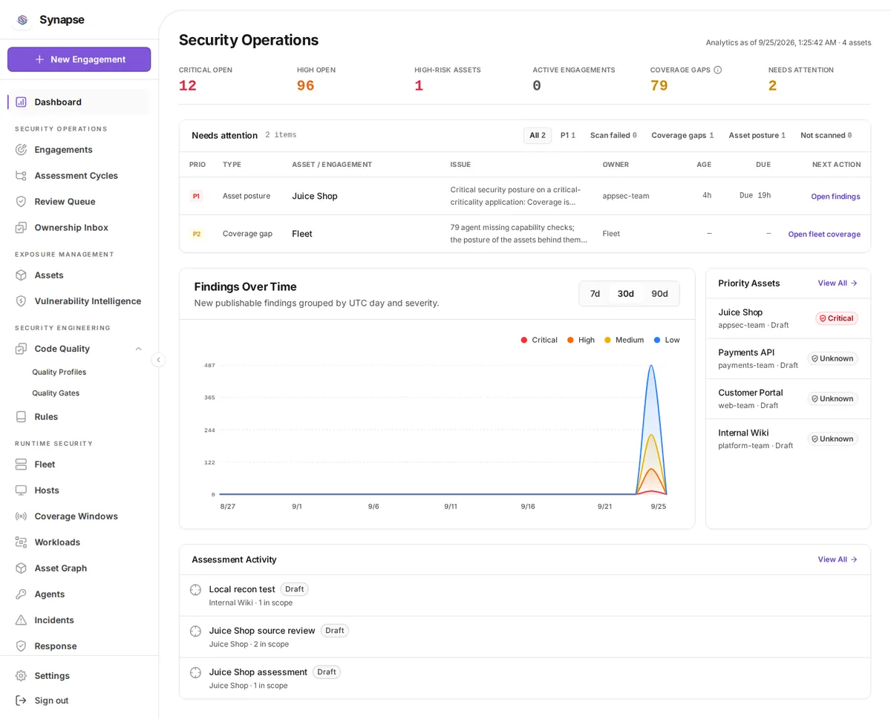

=== "Phone"

    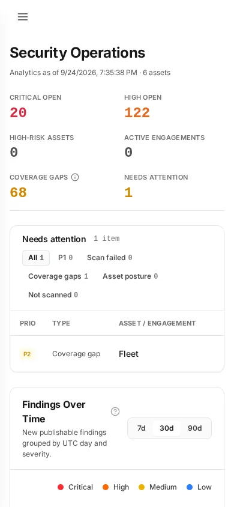

## Security operations

### Engagements

`/engagements`

Every time-boxed assessment with its scope, status and finding counts.

1. Read **Total**, **Active**, **Completed**, **Unassigned**.
2. Narrow with the search box and the `All Status` / `All Scope` selects.
3. The **Findings** column breaks down by **crit**, **high**, **med**, **low**, and **unrated** when a finding carries no severity yet.
4. Click a name to open the engagement; the copy icon copies its id.
5. `Import bundle` takes a CI bundle; `New Engagement` starts one.

=== "Desktop"

    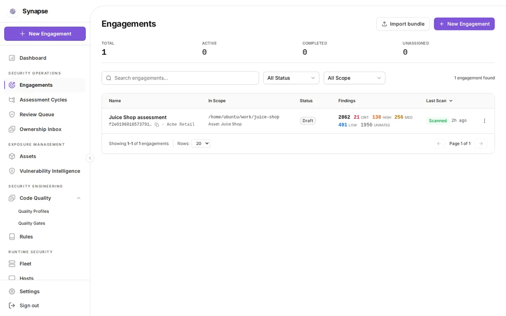

=== "Phone"

    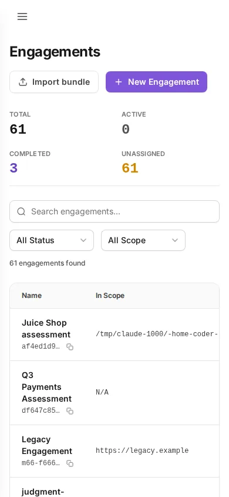

### New Engagement

`/engagements/new`

Creates the scope and the authorization window. Both are enforced server-side before any tool runs.

1. Name the engagement.
2. Pick the owner or leave it `Unassigned`.
3. Choose the target kind and enter the target.
4. `Add target` for each further target in scope.
5. `Create Engagement`.

=== "Desktop"

    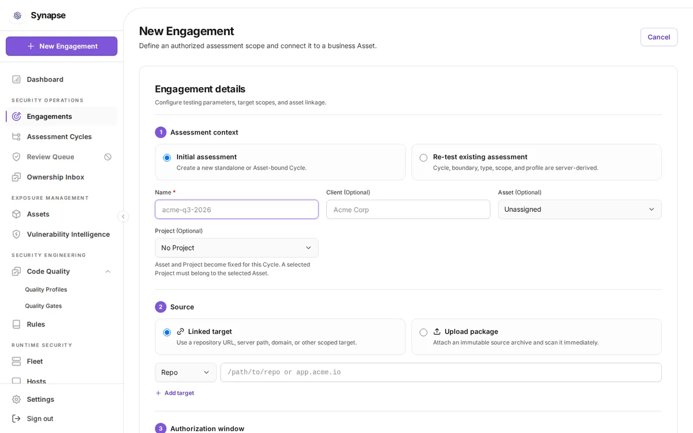

=== "Phone"

    

### Assessment cycles

`/assessment-cycles`

The long-lived cycle grouping an initial assessment and its re-tests.

1. Open a cycle for its frozen root-to-final path and closure history.
2. `Review closure` fetches a server-signed preview; a commit without one is refused.
3. `Review reopen` reverses it and keeps the sealed manifest immutable.
4. `Archive Cycle` ends it permanently; the dialog says so, because the domain allows no transition out of archived.

=== "Desktop"

    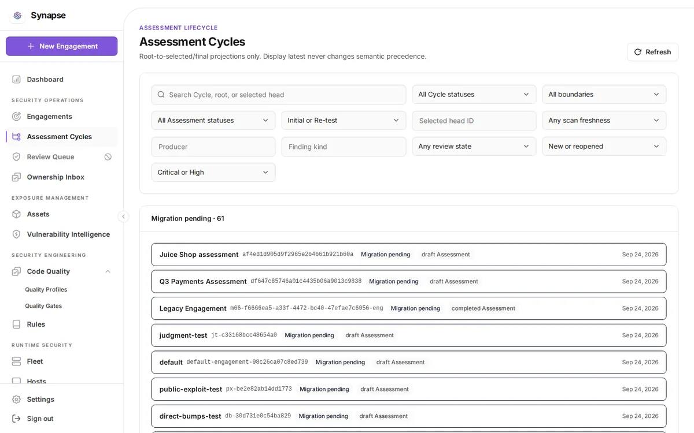

=== "Phone"

    

### AI Triage Reviews

`/ai-triage/reviews`

The human review queue for AI-proposed triage. A proposer never confirms its own claim.

1. Filter with `All severities`, `All projects`, `All states`.
2. Open a review to read the proposal and its evidence.
3. Claim it, then decide. The decision is recorded against your identity.

=== "Desktop"

    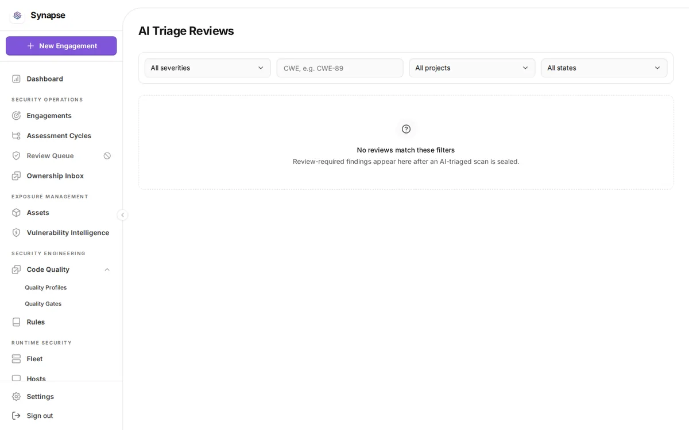

=== "Phone"

    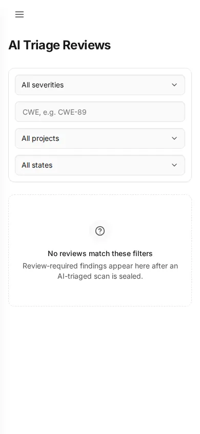

### Automation Observability

`/ai-triage/observability`

What the automation did and how well it held up, so the triage pipeline can be audited.

1. Read the counters.
2. `Refresh` re-pulls them.

=== "Desktop"

    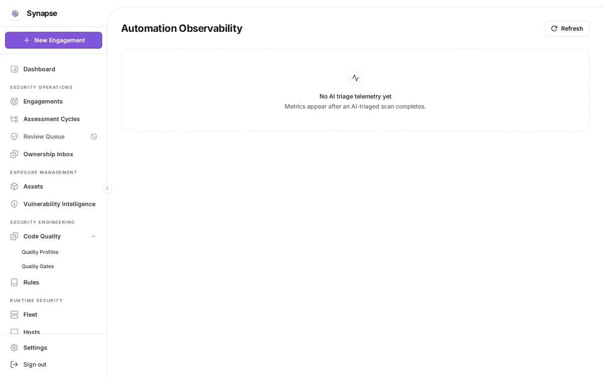

=== "Phone"

    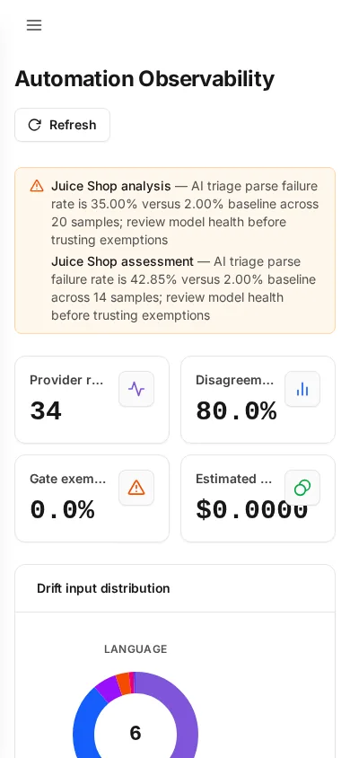

### Ownership inbox

`/ownership`

Findings routed to your teams, so each has a named owner.

1. Filter to your teams or to a severity.
2. Select findings and reassign in bulk.
3. Open one for its ownership history and who changed it.

=== "Desktop"

    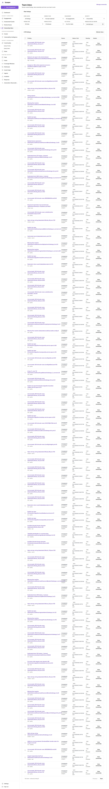

=== "Phone"

    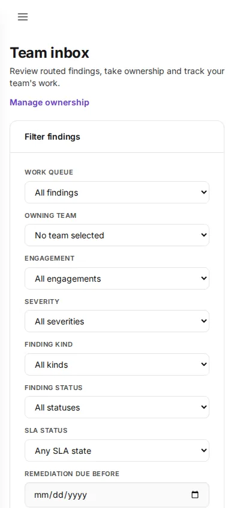

## Exposure management

### Security Asset Inventory

`/assets`

The business-asset estate: what exists, how critical, who owns it, and whether its posture is known.

1. **Total assets** and **Critical** are estate-wide; **Active on this page** and **Needs attention on this page** say their scope in the label.
2. Narrow with the search box and the type / criticality / lifecycle selects.
3. A posture of **Unknown** means not assessed, never clean.
4. Page with `Previous` / `Next`; the filter and the page are applied in the database.
5. `New Asset` adds one; the open arrow on a row opens the asset.

=== "Desktop"

    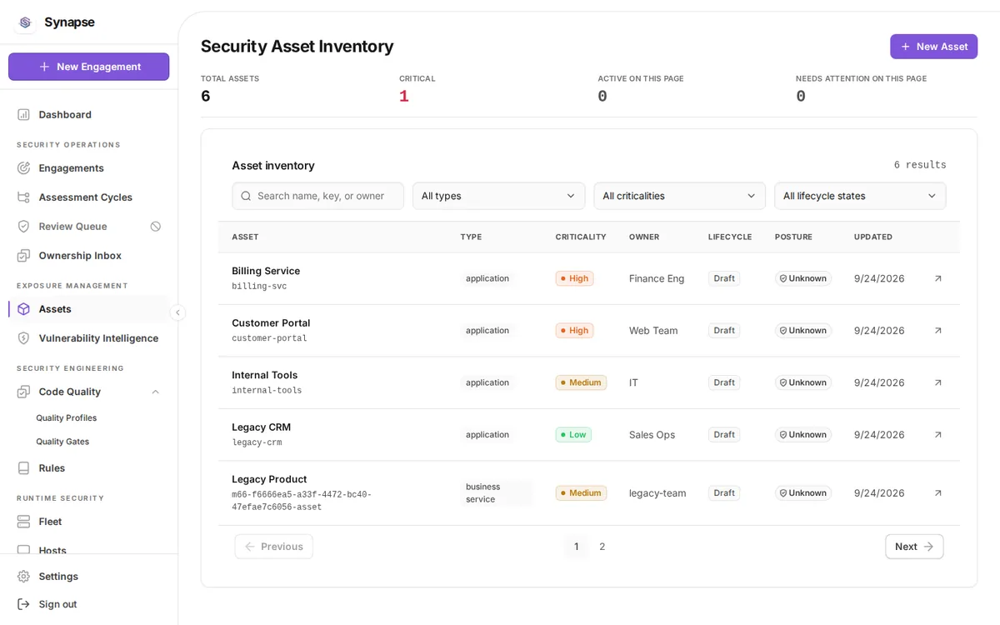

=== "Phone"

    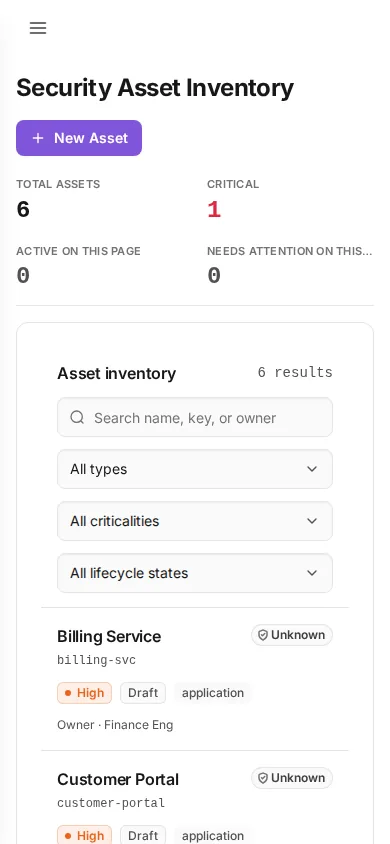

### Vulnerability Intelligence

`/vulnerability-intelligence`

Advisory ingest, the vulnerabilities it produced, and the machinery that keeps both current.

1. Move between `Overview`, `Vulnerabilities`, `Sources`, `Sync runs`, `Attack paths`, `Engine accuracy`.
2. `Sync all` pulls every enabled source; `Full sync all` re-pulls from the beginning.
3. `Full reconciliation` re-evaluates existing findings against the current advisory set.
4. **Engine accuracy** holds the owned engine's measured results, so a detection-quality claim can be checked.

=== "Desktop"

    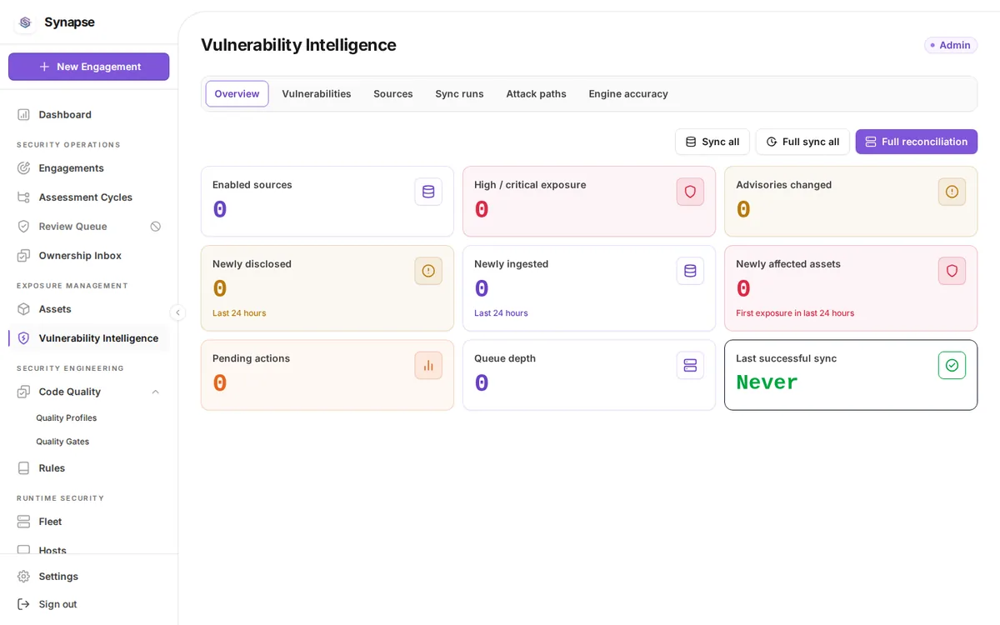

=== "Phone"

    

## Security engineering

### Code Quality

`/code-quality`

Long-lived project identities and their health, separate from time-boxed engagements.

1. Filter with `All health states`; order with `Recently analyzed`.
2. Open a project for its hotspots, issues, code, dependencies, measures, comparison, analysis and activity.
3. `New project` registers one.

=== "Desktop"

    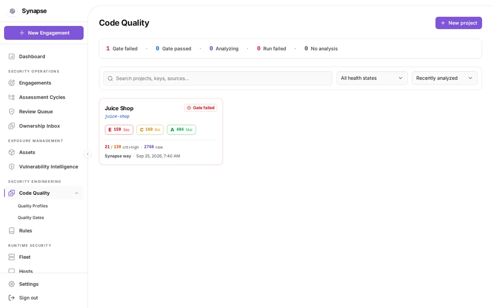

=== "Phone"

    

### Quality Gates

`/code-quality/gates`

The pass/fail conditions a project's analysis is judged against.

1. Filter by `All` / `Built-in` / `Custom`; order with `Name (A to Z)`.
2. Open a gate to read its conditions.
3. `New gate` creates a custom one; built-ins cannot be edited.

=== "Desktop"

    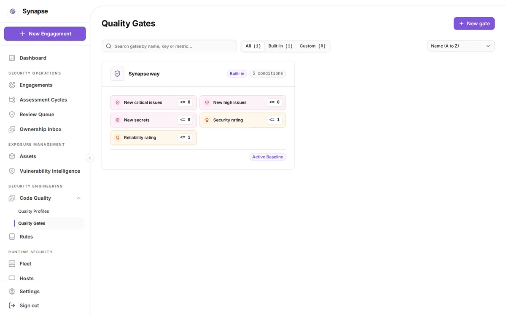

=== "Phone"

    

### Quality Profiles

`/code-quality/profiles`

Which rules are active per language. Ninety built-in profiles ship, three per language.

1. Filter by `All` / `Built-in` / `Custom`.
2. Pick a language group, then a profile; each row shows its active rule count.
3. Copy a built-in to get a custom profile you can edit.

=== "Desktop"

    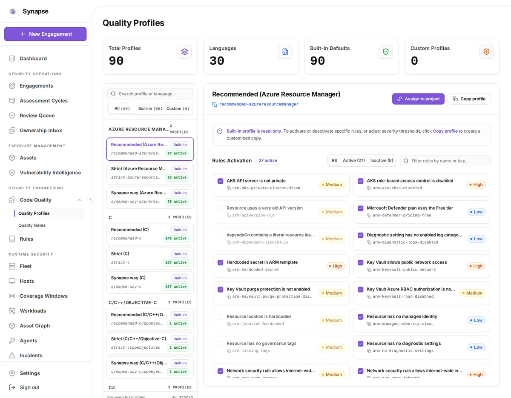

=== "Phone"

    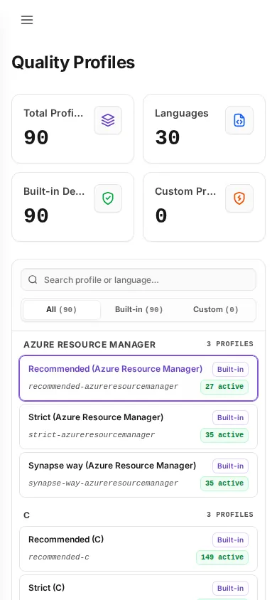

### Rules

`/rules`

The detection catalogue: every rule the scanners can apply.

1. Read **Vulnerabilities**, **Security hotspots**, **Code smells & bugs**, **Supported stacks**.
2. Filter with `Language`, `Type`, `Severity`, `Tag`, `CWE`.
3. The copy action on a row copies the rule key for a profile or a suppression.

=== "Desktop"

    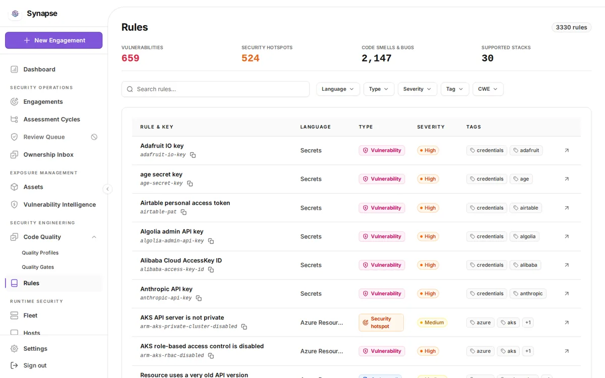

=== "Phone"

    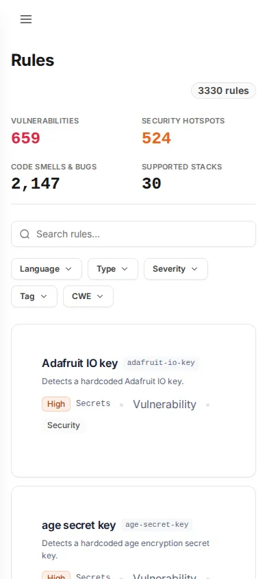

## Runtime security

### Fleet coverage

`/fleet`

Which assets an agent covers, per capability, and how fresh that coverage is.

1. Filter agents by `All` / `Healthy` / `Stale` / `Revoked`.
2. A verdict of **unauthorized** is its own label and is never folded into covered.
3. The desired-capability gaps section lists capabilities an asset should have and does not; a failure there is shown, not rendered as no gaps.
4. `Export CSV` takes the current view out.

=== "Desktop"

    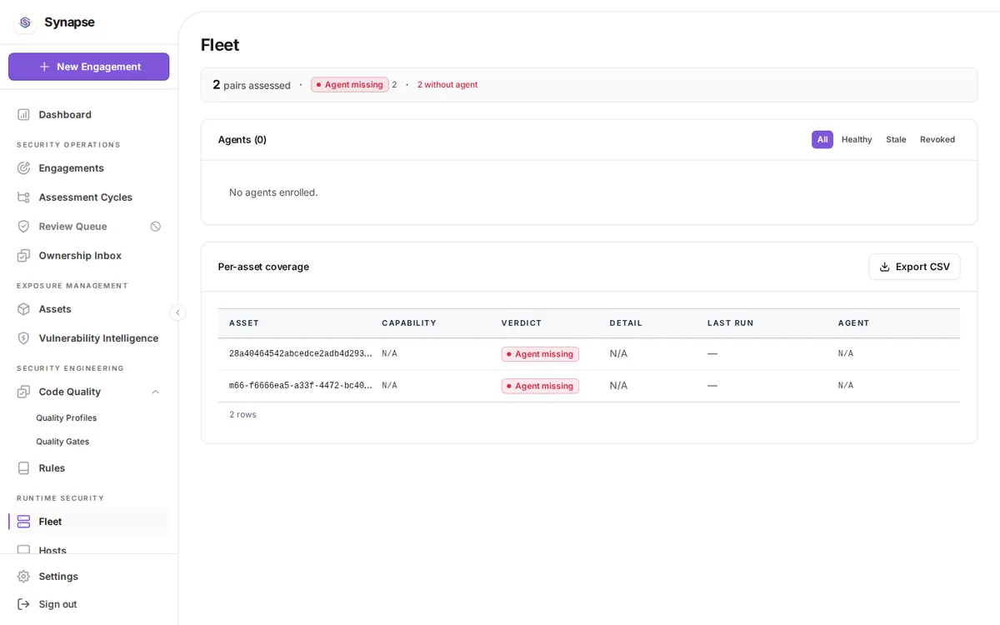

=== "Phone"

    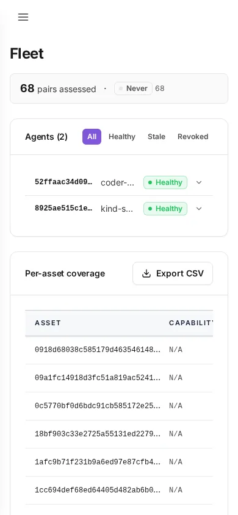

### Agent administration

`/fleet/agents`

Enrolment, staged rollout of the agent binary, and the lifecycle of an agent and its keys.

1. Set **Lifetime (minutes)** and press `Mint token`. The token is shown once and is spent on first use.
2. Enter **Set target version** and **Canary groups**, then `Set target`.
3. Promote, pause or resume the rollout; a pause takes a reason.
4. List an agent's keys, revoke one key, or revoke the agent with a reason.

=== "Desktop"

    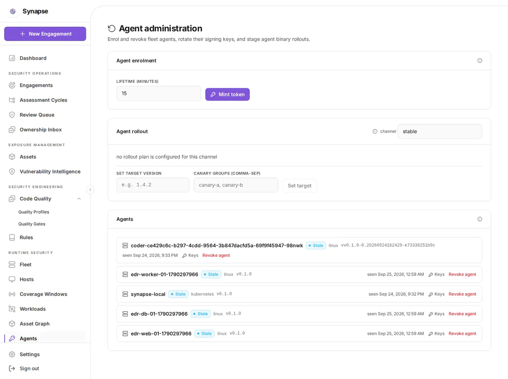

=== "Phone"

    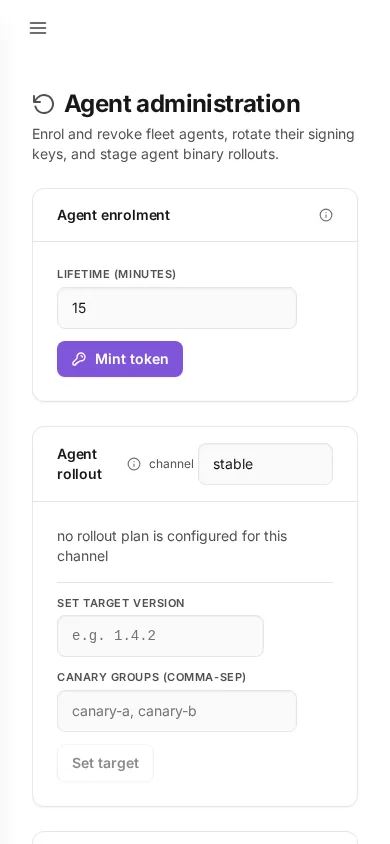

### Hosts

`/fleet/hosts`

Host inventory from the agents, with per-host packages and CVEs.

1. Search and filter the host list.
2. Open a host for its packages and the CVEs matched against them.

=== "Desktop"

    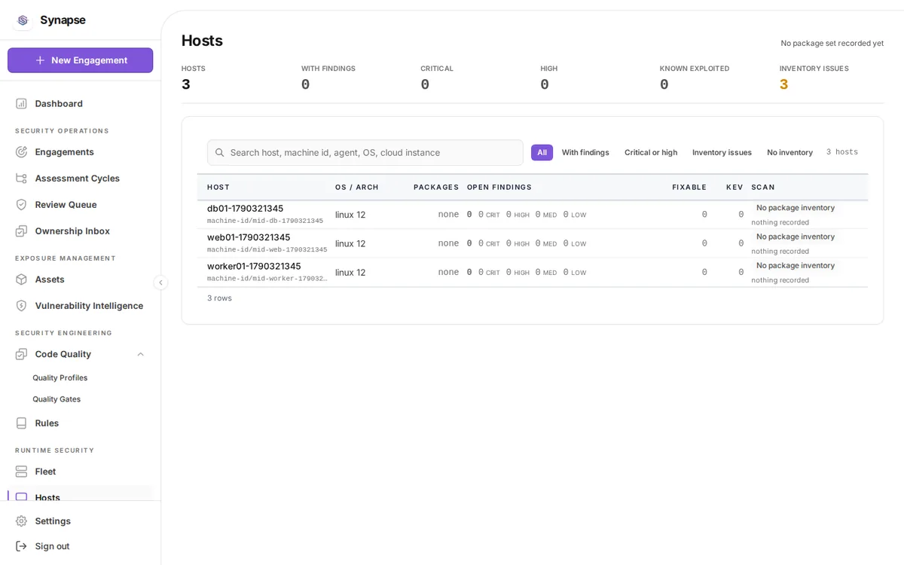

=== "Phone"

    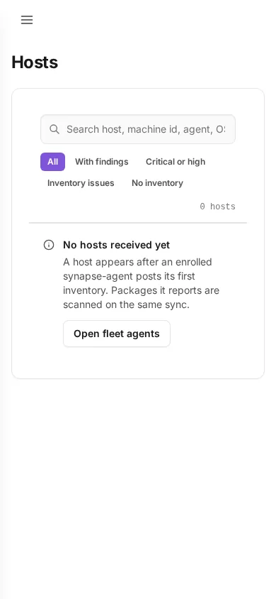

### Coverage windows

`/fleet/coverage-windows`

What an agent observed over a chosen span, used to retro-hunt collected telemetry.

1. Enter an **Asset id** and an **Agent id**.
2. Set the window.
3. `Apply` runs the hunt.

=== "Desktop"

    

=== "Phone"

    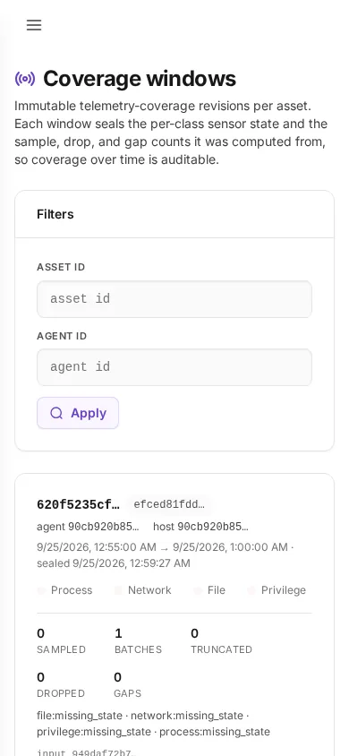

### Kubernetes Workloads

`/fleet/workloads`

Cluster workloads the cluster agent reported, with their images and service accounts.

1. `About workloads` explains what the cluster agent collects and what it does not.
2. Read cluster, namespace, kind, name, service account and images.

=== "Desktop"

    

=== "Phone"

    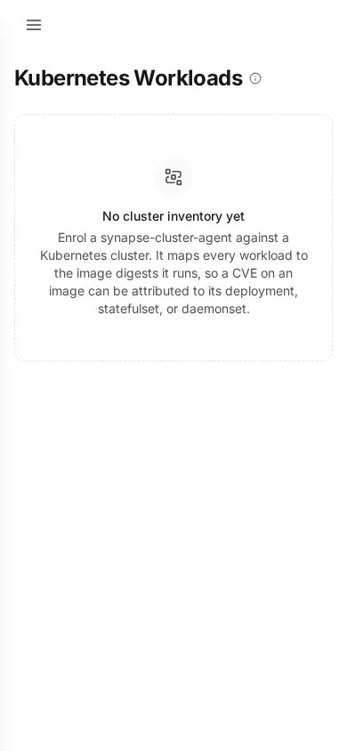

### Asset graph

`/fleet/asset-graph`

How technical assets relate. Every edge carries provenance, so inferred is never shown as observed.

1. `Observed vs inferred` explains the distinction the graph encodes.
2. Fill **From**, **Kind**, **To**, **Confidence**, **Provenance**.
3. `Add relationship` commits it; creation is idempotent on the natural key.

=== "Desktop"

    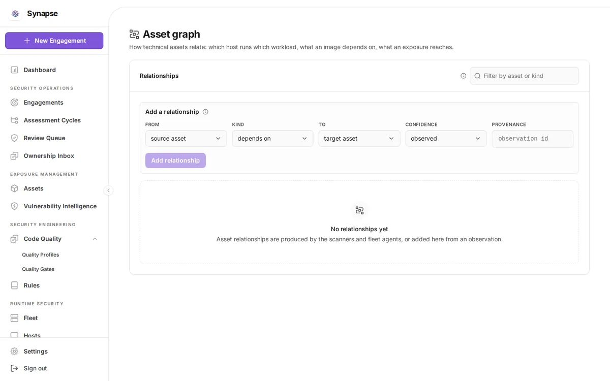

=== "Phone"

    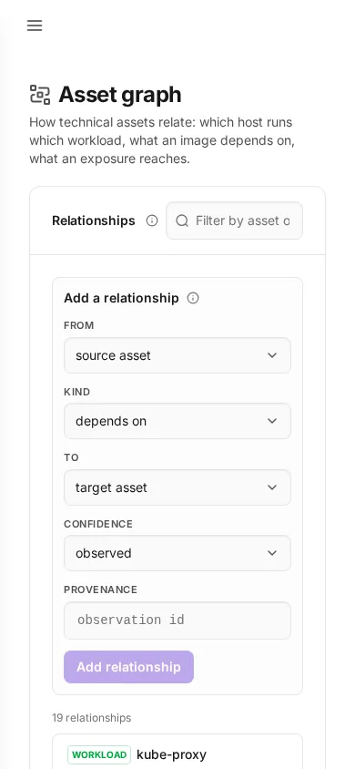

### Incidents

`/fleet/incidents`

Runtime incidents raised from agent telemetry, tracked through their lifecycle.

1. Read **Open**, **Critical unresolved**, **In progress**, **Resolved**.
2. Filter by state: new, open, triaged, investigating, contained, remediated, resolved, closed, reopened.
3. Open an incident for its timeline and the response actions taken.

=== "Desktop"

    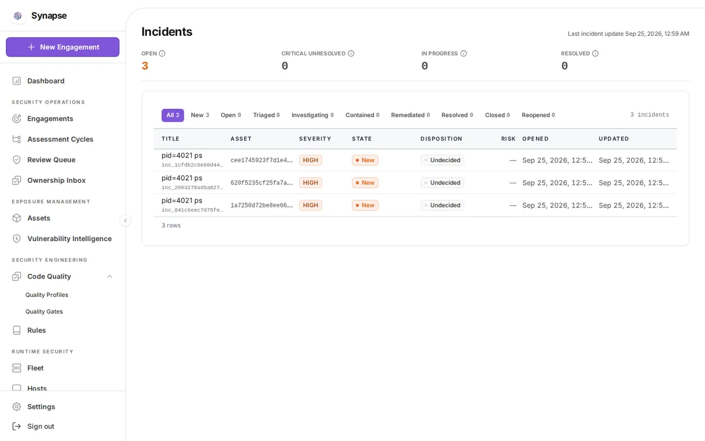

=== "Phone"

    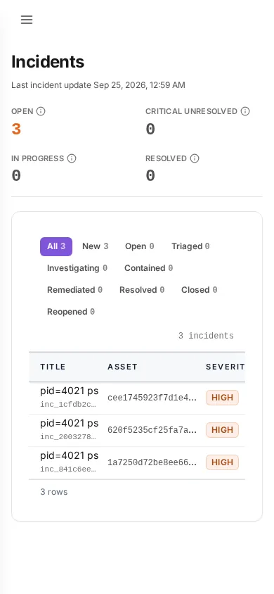

### Response operations

`/blueteam/response`

Defensive actions against a live target. Every action is planned as a dry run first.

1. Pick the **Engagement**.
2. Pick the **Action** and name the **Target**.
3. `Plan (dry run)` first; the plan is what you review before anything executes.
4. Follow the record list with `all` / `pending` / `applied` / `reverted` / `failed`.
5. `Halt offensive work` stops the engagement's offensive activity.

=== "Desktop"

    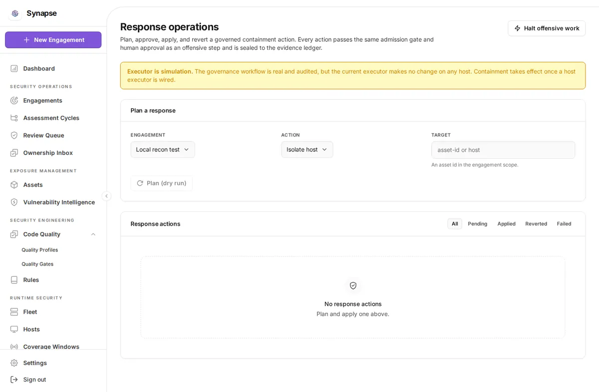

=== "Phone"

    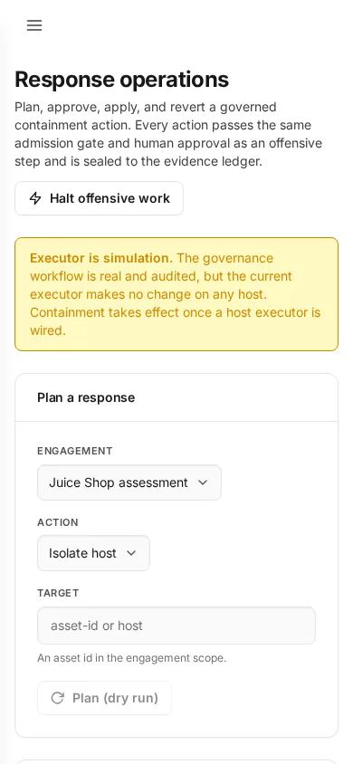

## Settings

### Audit trail

`/settings`

The audit log is hash-chained and append-only, and this screen can verify the chain.

1. Read **Time**, **Actor**, **Action**, **Target**, **Details**.
2. `Re-verify` re-walks the chain and reports whether it is intact, including unchained entries.

=== "Desktop"

    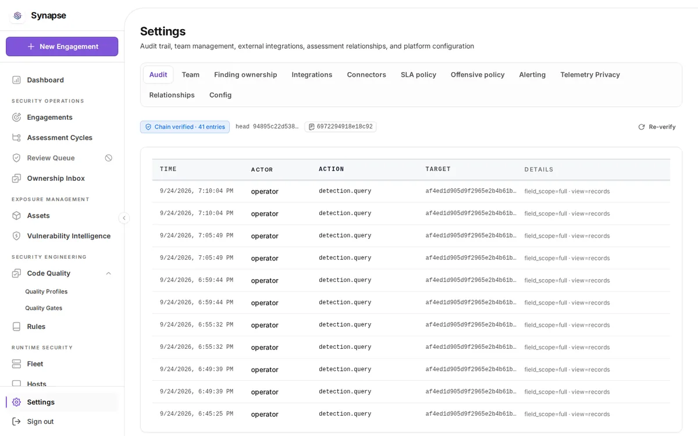

=== "Phone"

    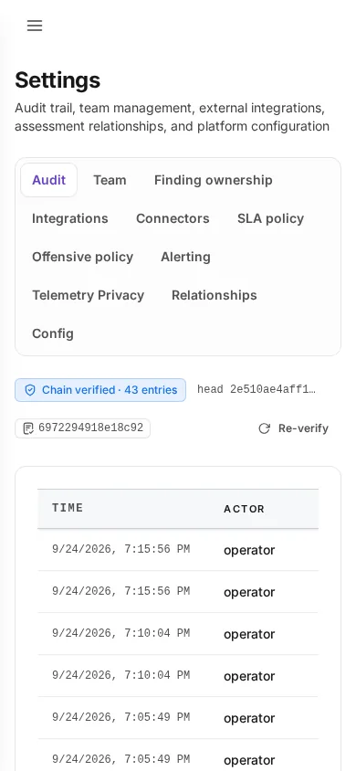

### Team

`/settings/team`

Who can sign in, what they can do, and their API keys.

1. Type a name, pick a role, press `Add`. The API key appears once.
2. `Change role` opens a radio group on the row; pick a role, then `Save role`. Selecting alone does nothing, because a privilege change should not happen on a stray click.
3. `Disable` revokes access and keeps the account and its audit trail; it becomes `Enable`.
4. `Rotate key` issues a new key and stops the previous one immediately.
5. A failed action is written on the row, not only in the toast.

=== "Desktop"

    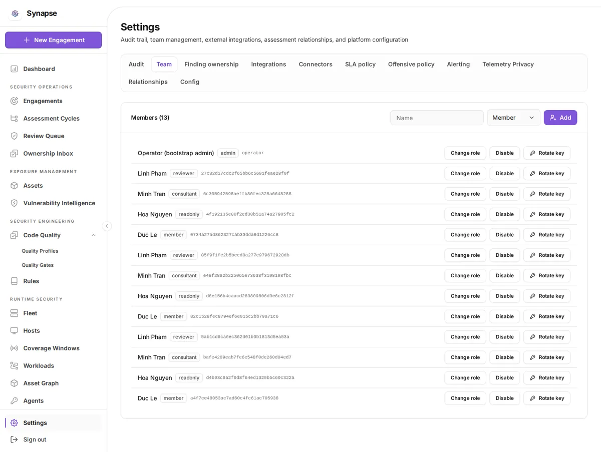

=== "Phone"

    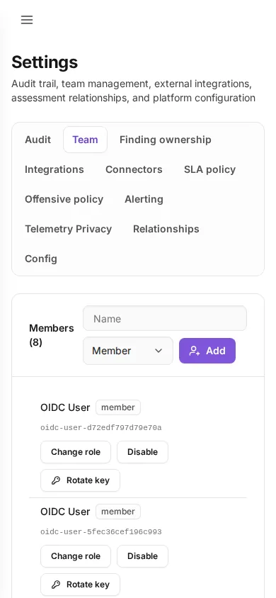

### Finding ownership

`/settings/ownership`

Teams, members and the routing policy that decides which team owns a finding.

1. Define teams and members.
2. Map repositories and assets to teams.
3. Author a policy version, preview it against real findings, then activate the version you reviewed.

=== "Desktop"

    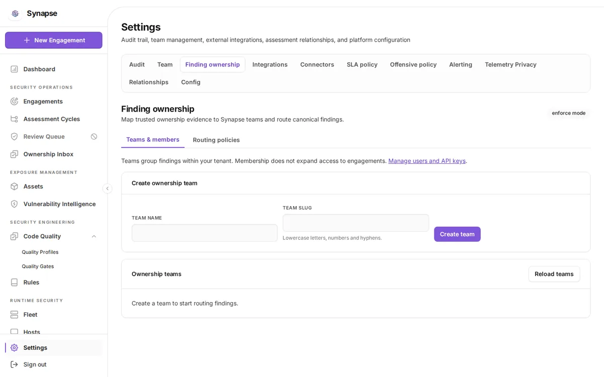

=== "Phone"

    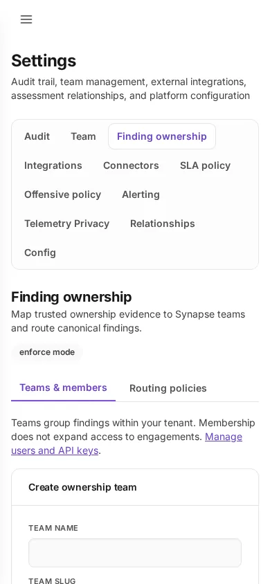

### Integrations

`/settings/integrations`

Outbound systems Synapse talks to, and whether each is enabled.

1. Add an integration and supply its credential; secrets go to the vault.
2. Enable or disable one without deleting it.
3. Check its bindings to see what it is wired to.

=== "Desktop"

    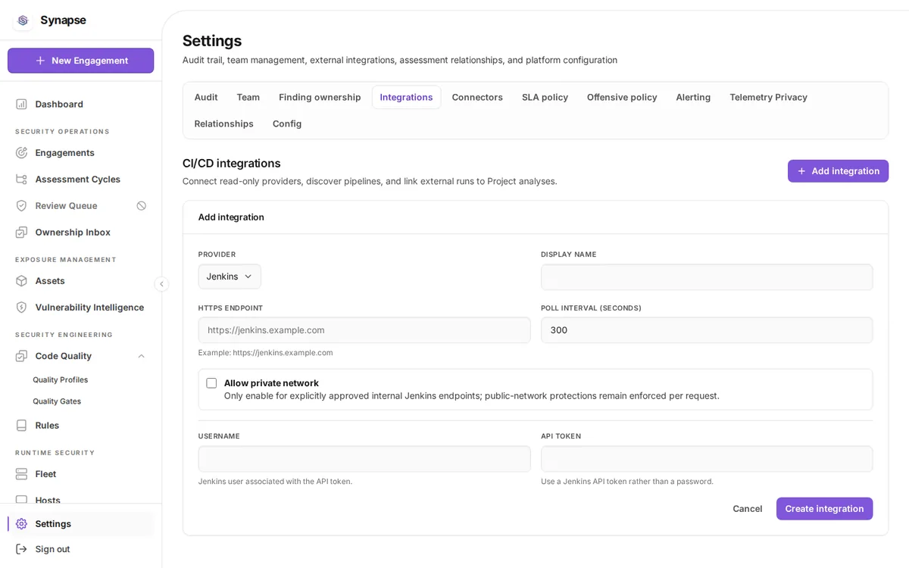

=== "Phone"

    

### Connectors

`/settings/connectors`

Source-control hosts a scan can clone a private repository from.

1. Pick the **Provider**, then fill **Name**, **Host**, **Username** and the **Personal access token**.
2. The token is encrypted at rest and supplied to git only at clone time.
3. `Add connector` saves it.

=== "Desktop"

    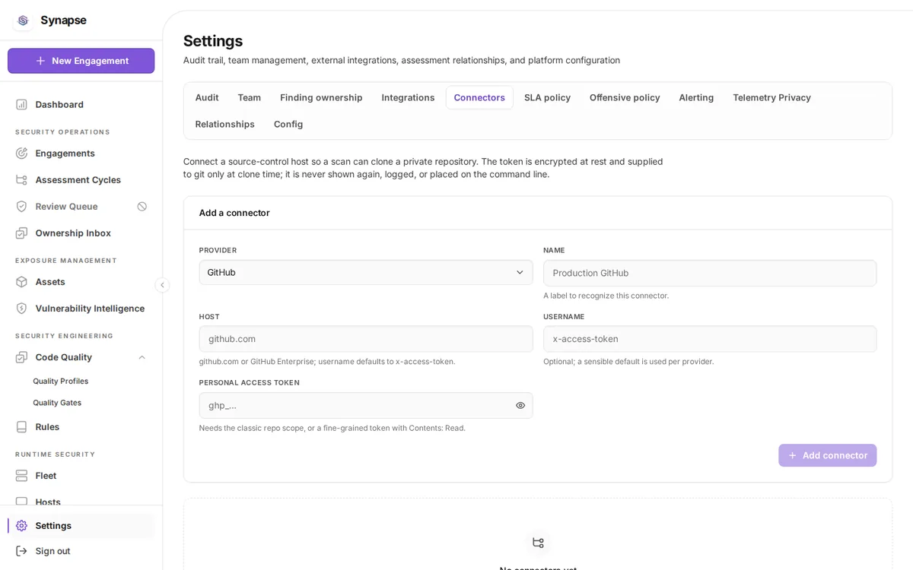

=== "Phone"

    

### SLA policy

`/settings/sla`

How a finding's remediation deadline is computed. The policy is versioned.

1. Set the **Version label**.
2. Set **Factor weights**: severity, exploitability, threat intel, exposure and the rest.
3. Set **Tier thresholds & due windows**: **Tier**, **Score ≥**, **Mitigate**, **Remediate**.
4. `Activate` makes this version the one new assessments use; existing findings are unchanged until reassessed.

=== "Desktop"

    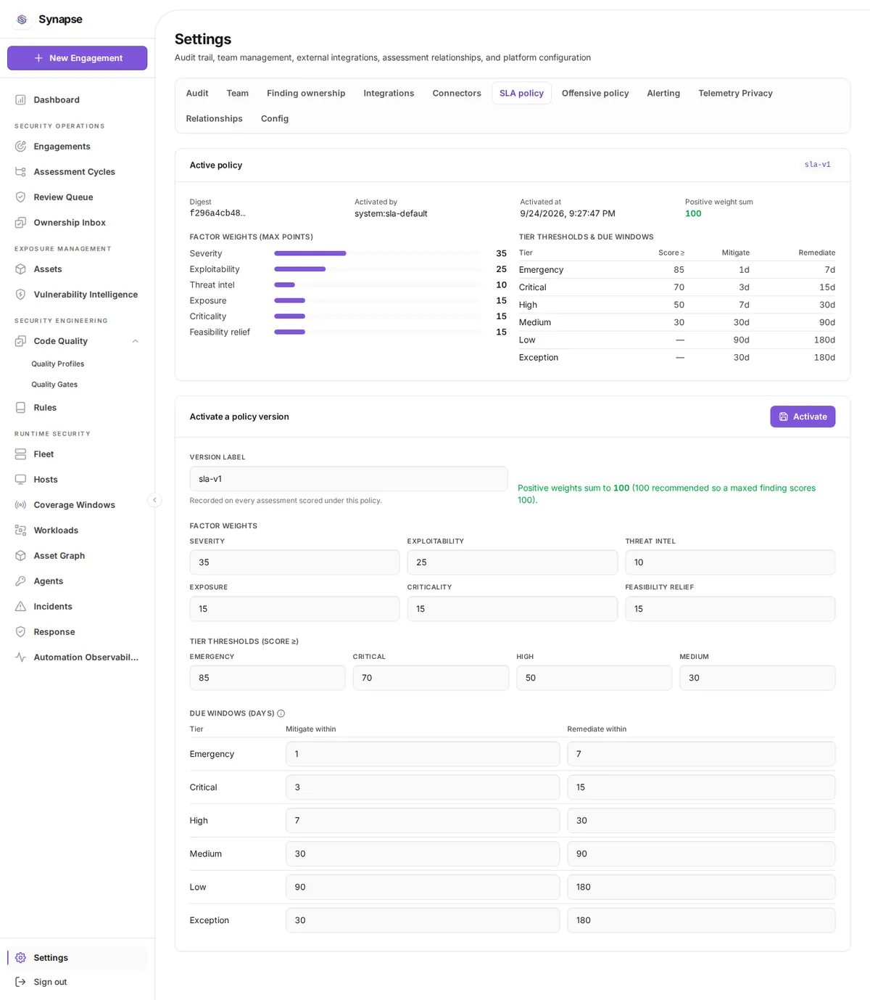

=== "Phone"

    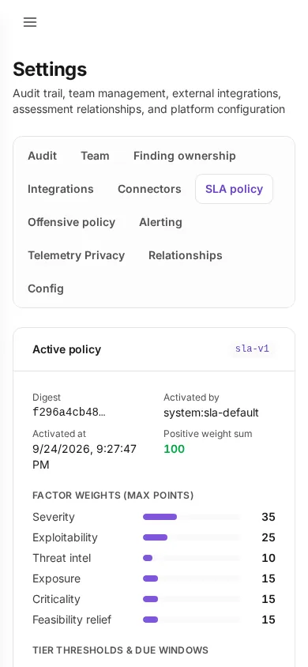

### Offensive policy

`/settings/offensive-policy`

What offensive tooling is permitted and under what authorization.

1. Set the policy for the tenant.
2. Save it; the change lands in the audit trail.

=== "Desktop"

    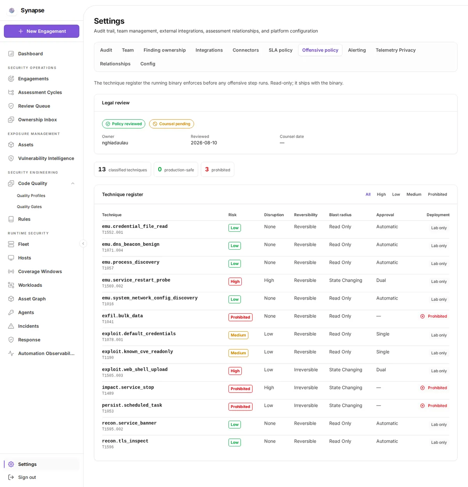

=== "Phone"

    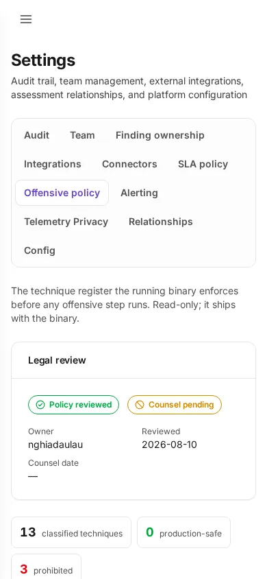

### Alerting

`/settings/alerting`

Where notifications go, which events trigger them, and what was delivered.

1. `Add channel`, then set **Type**, **Name**, **Webhook URL**, **HMAC secret**.
2. Add rules mapping events to channels.
3. `Send test alert` proves the path end to end before you rely on it.
4. Review deliveries with the channel / event / state filters; open one to see each attempt.

=== "Desktop"

    

=== "Phone"

    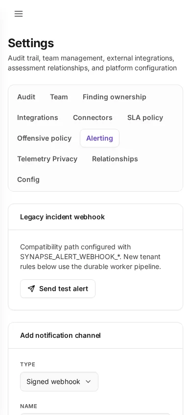

### Telemetry privacy

`/settings/privacy`

What agent telemetry is retained and what is redacted before storage.

1. Read the active policy.
2. Change what is collected and redacted, then save a new version.

=== "Desktop"

    

=== "Phone"

    

### Relationships

`/settings/relationships`

Proposed links between assessments, reviewed before they are committed.

1. Read each candidate and its evidence.
2. Preview the change, then commit the preview you reviewed.

=== "Desktop"

    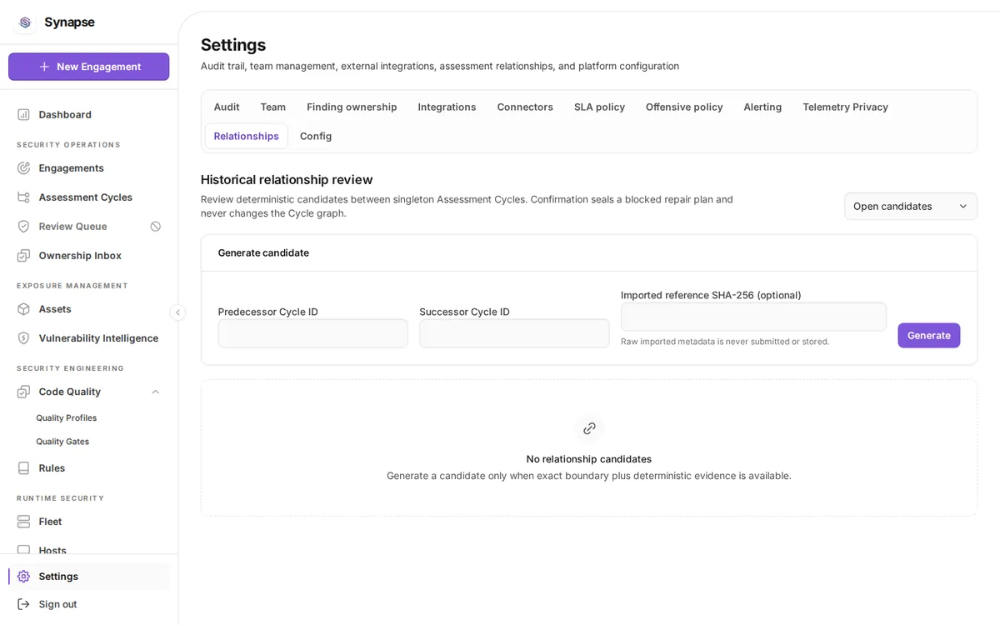

=== "Phone"

    

### Config

`/settings/config`

Per-person preferences and the session.

1. Pick `Light`, `System` or `Dark`.
2. `Disconnect` ends the session.

=== "Desktop"

    

=== "Phone"

    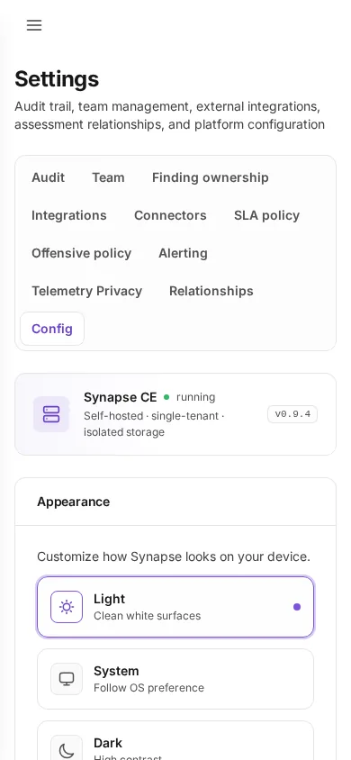

## Engagement detail

`/engagements/{id}/{tab}`: twenty-eight tabs in five groups. The header carries `Build report`,
`Export`, `Import`, `Scan settings` and `Run scan` on every tab, and the scan panel shows the
pipeline stages with their timings.

### Overview

`/engagements/{id}/overview`

Scan health, the pipeline journey with per-stage timings, risk analysis and inventory counts.

=== "Desktop"

    

=== "Phone"

    

### Findings

`/engagements/{id}/findings`

Every finding, ranked. Columns: **Pri**, **Severity**, **Finding & Details**, **Scope**, **Status**.

=== "Desktop"

    

=== "Phone"

    

### Imported

`/engagements/{id}/imported`

Findings ingested from another tool, kept distinct from what Synapse detected.

=== "Desktop"

    

=== "Phone"

    

### Comparison

`/engagements/{id}/comparison`

Two immutable snapshots compared. `Finalize snapshot` creates one from selected scan runs.

=== "Desktop"

    

=== "Phone"

    

### Remediation SLA

`/engagements/{id}/sla`

Deadlines per finding: **Tier / score**, **Mitigate by**, **Remediate by**, **Workflow**, **Policy**. `Transition` records a state change with its audit reason, and shows the prior transitions and deadline assessments.

=== "Desktop"

    

=== "Phone"

    

### Risk Stories

`/engagements/{id}/risk-stories`

Per-asset risk narrative assembled from the findings.

=== "Desktop"

    

=== "Phone"

    

### Vuln Posture

`/engagements/{id}/vuln-posture`

Vulnerability posture for this engagement, with an acknowledge / resolve queue.

=== "Desktop"

    

=== "Phone"

    

### Packages

`/engagements/{id}/components`

The software bill of materials: every package the scan cataloged.

=== "Desktop"

    

=== "Phone"

    

### Vulnerabilities

`/engagements/{id}/vulns`

Advisory matches against the cataloged packages.

=== "Desktop"

    

=== "Phone"

    

### Licenses

`/engagements/{id}/licenses`

License obligations per component, with the policy verdict.

=== "Desktop"

    

=== "Phone"

    

### Dependency graph

`/engagements/{id}/graph`

The dependency tree, loaded as its own chunk because only this tab needs it.

=== "Desktop"

    

=== "Phone"

    

### Scan runs

`/engagements/{id}/scanruns`

Every run with its provenance lanes, and the drift between runs.

=== "Desktop"

    

=== "Phone"

    

### Credentials

`/engagements/{id}/credentials`

Credentials in scope for this engagement, vault-backed.

=== "Desktop"

    

=== "Phone"

    

### Code quality

`/engagements/{id}/quality`

The code-quality view scoped to this engagement.

=== "Desktop"

    

=== "Phone"

    

### Threat model

`/engagements/{id}/threats`

The threat model for the target.

=== "Desktop"

    

=== "Phone"

    

### Recon

`/engagements/{id}/recon`

Recon runs. A run is proposed, gated on scope and authorization, then approved by a human.

=== "Desktop"

    

=== "Phone"

    

### Purple coverage

`/engagements/{id}/purple`

Which detections cover which attack techniques.

=== "Desktop"

    

=== "Phone"

    

### Chain rehearsal

`/engagements/{id}/rehearsal`

Attack-chain rehearsal against the modelled path.

=== "Desktop"

    

=== "Phone"

    

### AI agent

`/engagements/{id}/agent`

The AI session transcript: the goal, each tool call, and the token cost.

=== "Desktop"

    

=== "Phone"

    

### Cloud posture

`/engagements/{id}/cspm`

Cloud posture findings; an unknown-state resource stays NotAssessed.

=== "Desktop"

    

=== "Phone"

    

### DAST

`/engagements/{id}/dast`

Dynamic testing. A scan or probe is proposed and a distinct reviewer approves it.

=== "Desktop"

    

=== "Phone"

    

### Detections

`/engagements/{id}/detections`

Runtime detections correlated to this engagement.

=== "Desktop"

    

=== "Phone"

    

### Detection provenance

`/engagements/{id}/detection-provenance`

Where each detection came from and what it was derived from.

=== "Desktop"

    

=== "Phone"

    

### Judgment review

`/engagements/{id}/reviews`

The propose / verify / confirm record, with the hash-chained evidence ledger.

=== "Desktop"

    

=== "Phone"

    

### Evidence

`/engagements/{id}/evidence`

The evidence ledger itself. A broken chain blocks the report.

=== "Desktop"

    

=== "Phone"

    

### Data governance

`/engagements/{id}/data-governance`

Retention and handling for the data this engagement holds.

=== "Desktop"

    

=== "Phone"

    

### Write-up drafts

`/engagements/{id}/writeup-drafts`

AI-drafted write-ups, unconfirmed until a human accepts them.

=== "Desktop"

    

=== "Phone"

    

### Settings

`/engagements/{id}/settings`

Scope, authorization window, rules of engagement, and the engagement lifecycle.

=== "Desktop"

    

=== "Phone"

    

## Asset detail

`/assets/{key}` and its tabs. The route accepts either the asset id or its tenant-scoped
business key.

### Overview

`/assets/{key}`

Criticality, owner, lifecycle and posture for one business asset.

=== "Desktop"

    

=== "Phone"

    

### Components

`/assets/{key}/components`

The projects and technical assets that make up this business asset.

=== "Desktop"

    

=== "Phone"

    

### Engagements

`/assets/{key}/engagements`

Every assessment that covered this asset.

=== "Desktop"

    

=== "Phone"

    

### Findings

`/assets/{key}/findings`

Findings aggregated across those assessments.

=== "Desktop"

    

=== "Phone"

    

### Coverage

`/assets/{key}/coverage`

Which components were assessed, by what, and how recently.

=== "Desktop"

    

=== "Phone"

    

### History

`/assets/{key}/history`

The assessment history for the asset.

=== "Desktop"

    

=== "Phone"

    

## Code quality project

`/code-quality/projects/{key}` and its tabs.

### Overview

`/code-quality/projects/{key}`

Project health, the managed gate verdict, and the trend.

=== "Desktop"

    

=== "Phone"

    

### Security hotspots

`/code-quality/projects/{key}/hotspots`

Code needing a security review decision.

=== "Desktop"

    

=== "Phone"

    

### Issues

`/code-quality/projects/{key}/issues`

Every issue with its rule, severity and status. The inspector shows the review history behind the current status before you reclassify.

=== "Desktop"

    

=== "Phone"

    

### Code

`/code-quality/projects/{key}/code`

The analysed source, annotated with its findings.

=== "Desktop"

    

=== "Phone"

    

### Dependencies

`/code-quality/projects/{key}/dependencies`

The dependency tree with risky paths marked.

=== "Desktop"

    

=== "Phone"

    

### Measures

`/code-quality/projects/{key}/measures`

The measured metrics for the analysis.

=== "Desktop"

    

=== "Phone"

    

### Compare

`/code-quality/projects/{key}/compare`

Two analyses compared.

=== "Desktop"

    

=== "Phone"

    

### Analysis

`/code-quality/projects/{key}/analysis`

One analysis in detail.

=== "Desktop"

    

=== "Phone"

    

### Activity

`/code-quality/projects/{key}/activity`

The analysis history, which is where a CI push lands.

=== "Desktop"

    

=== "Phone"

    

